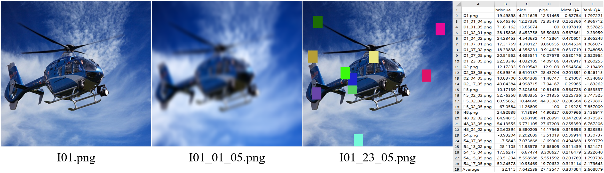

# No-Reference Image Quality Assessment Algorithms

---


No-reference Image Quality Assessment(**NIQA**) is a task of evaluating an image without a reference image. Since the evaluation algorithm learns the features of good quality images and scores input images, a training process is required.




---

## 1. Target Research Papers

1. **BRISQUE**: Mittal, Anish, Anush Krishna Moorthy, and Alan Conrad Bovik. "No-reference image quality assessment in the spatial domain." _IEEE Transactions on Image Processing (TIP)_ 21.12 (2012): 4695-4708.

2. **NIQE**: Mittal, Anish, Rajiv Soundararajan, and Alan C. Bovik. "Making a “completely blind” image quality analyzer." _IEEE Signal Processing Letters (SPL)_ 20.3 (2012): 209-212.

3. **PIQE**: Venkatanath, N., et al. "Blind image quality evaluation using perception based features." _2015 Twenty First National Conference on Communications (NCC)._ IEEE, 2015.

4. **RankIQA**: Liu, Xialei, Joost Van De Weijer, and Andrew D. Bagdanov. "Rankiqa: Learning from rankings for no-reference image quality assessment." _Proceedings of the IEEE International Conference on Computer Vision (ICCV)._ 2017.

5. **MetaIQA**: Zhu, Hancheng, et al. "MetaIQA: Deep meta-learning for no-reference image quality assessment." _Proceedings of the IEEE/CVF Conference on Computer Vision and Pattern Recognition (CVPR)._ 2020.

---
## 2. Dependencies
I used the following libraries in Windows 10.
```
python == 3.9.7

pillow == 8.4.0

tqdm == 4.62.3

pytorch == 1.10.1

torchvision == 0.11.2

opencv-python == 4.5.4.60

scipy == 1.7.1

pandas == 1.3.4
```
---

## 3. Quick Start

Download the pre-trained model checkpoint files.

1. RankIQA: https://drive.google.com/drive/folders/1Y2WgNHL6vowvKA0ISGUefQiggvrCL5rl?usp=sharing

    default directory: ./RankIQA/Rank_live.caffemodel.pt

2. MetaIQA: https://drive.google.com/drive/folders/1SCo56y9s0yB-TPcnVHqoc63TZ2ngSxPG?usp=sharing

    default directory: ./MetaIQA/metaiqa.pth

### Windows User

- Run demo1.bat & demo2.bat in the windows terminal.

### Linux User

- Run demo1.sh & demo2.sh in the linux terminal.

Check "options.py" as well. The demo files are tutorials.

The demo images are from **_KADID10K_** dataset: http://database.mmsp-kn.de/kadid-10k-database.html

---
## 4. Acknowledgements

### Repositories

1. BRISQUE(&darr;): https://github.com/spmallick/learnopencv/blob/master/ImageMetrics/Python/brisquequality.py
2. NIQE(&darr;): https://github.com/guptapraful/niqe
3. NIQE model parameters: https://github.com/csjunxu/Bovik_NIQE_SPL2013
4. PIQE(&darr;): https://github.com/buyizhiyou/NRVQA
5. RankIQA(&darr;): https://github.com/YunanZhu/Pytorch-TestRankIQA
6. MetaIQA(&uarr;): https://github.com/zhuhancheng/MetaIQA

### Images
1. KADID10K: http://database.mmsp-kn.de/kadid-10k-database.html

---
## 5. Author

Dae-Young Song

M.S. Student, Department of Electronics Engineering, Chungnam National University

Github: https://github.com/EadCat